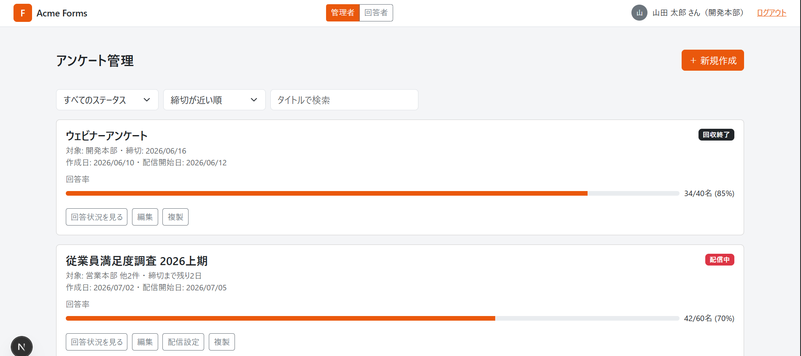
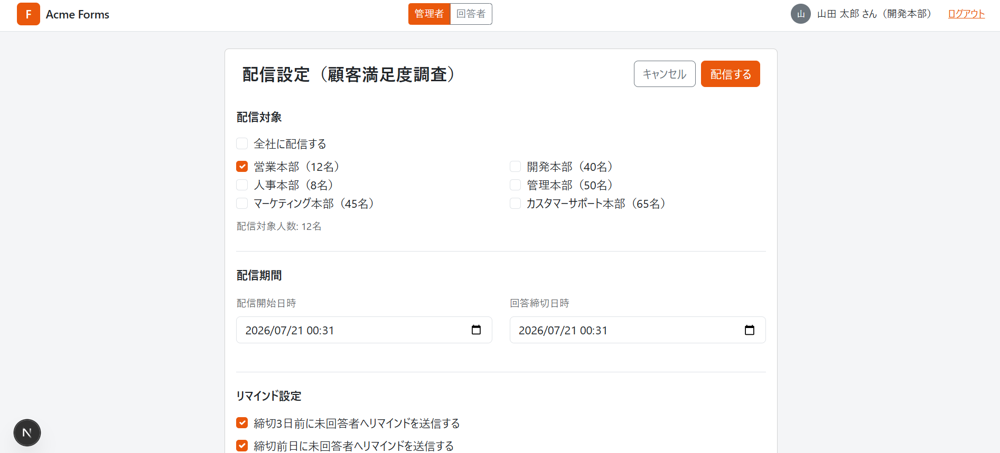
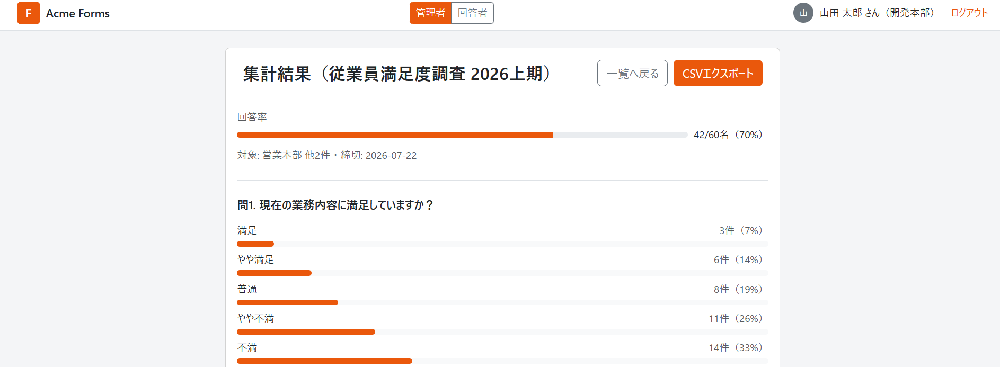

# Acme Forms (form-mock-answer)

社内向けアンケートシステムの画面モック。Next.js (App Router) + TypeScript + react-bootstrap。

管理者・回答者ともに同じアカウントで、Header右上の「管理者 / 回答者」タブを切り替えて両方の画面を確認できます。

## 画面遷移

```
ログイン
  └─ 管理者: アンケート管理(一覧)
       ├─ 新規アンケート作成 → 作成完了
       ├─ 編集 / プレビュー
       ├─ 配信設定(対象本部・配信期間・リマインド設定)
       └─ 集計結果(グラフ・CSV出力)

  └─ 回答者: 割当アンケート一覧(未回答/回答済み)
       └─ 回答入力(一時保存 → 再開可能) → 送信完了
```

## 管理者フロー

### ログイン


### アンケート管理(一覧)

ステータス(下書き/配信中/回収終了)での絞り込み、並び替え、タイトル検索。カードから複製・削除・配信設定などのクイックアクションが行えます。



### 新規アンケート作成

テンプレートから作成するか、単一選択・複数選択・評価尺度・マトリックス・テキスト系など8種類の質問タイプで自由に質問項目を組み立てられます(ドラッグ&ドロップで並び替え可能)。


### 編集 / プレビュー


### 配信設定

対象本部の選択(本部単位・全社一括)、配信期間、リマインド送信タイミング、回答条件(匿名/記名など)を設定します。



### 集計結果

質問ごとの回答分布をグラフで表示し、CSVエクスポートも行えます。



## 回答者フロー

### 割当アンケート一覧

自分の所属本部宛てに配布されたアンケートを、未回答/回答済みで絞り込んで確認できます。


### 回答入力

選択式・自由記述などの質問に回答します。入力途中でも一時保存でき、後から再開可能です。


### 送信完了


## 主な技術構成

- Next.js App Router(ルートベースの画面遷移、`app/admin/*` と `app/respond/*` で役割を分離)
- TypeScript
- react-bootstrap(UIコンポーネント) + Bootstrap CSS変数のオレンジテーマ上書き
- モックデータは `lib/` 配下にメモリ上のみで保持(サーバー永続化なし)

## 開発

```bash
npm install
npm run dev
```
