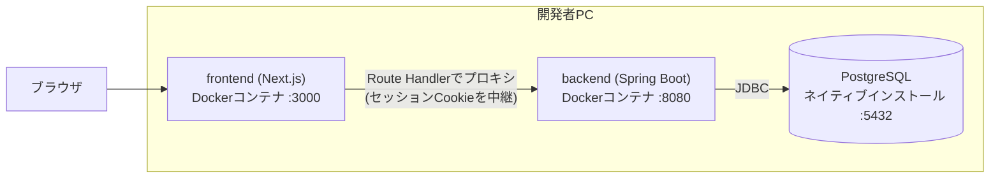
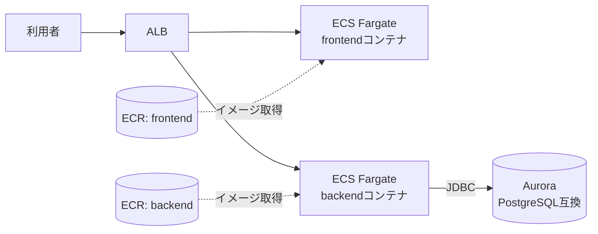

# form-mock-answer

社内向けアンケートシステムのモノレポ。フロントエンドとバックエンドを1つのリポジトリで管理しています。AWS学習用に、ローカル動作 → GitHub/CI → コンテナ化 → AWSデプロイ、という段階を追って構築しています。

## 構成

| ディレクトリ | 内容 |
|---|---|
| [`frontend/`](frontend/) | Next.js (App Router) + TypeScript + react-bootstrap による画面。詳細は [frontend/README.md](frontend/README.md) を参照 |
| [`backend/`](backend/) | Spring Boot + Doma によるREST API(`survey`)。認証はセッションベースの自前実装(`esq_user`) |

## 進捗状況

学習計画は6フェーズ。現在はフェーズ4に着手した段階です。

| # | フェーズ | 状態 |
|---|---|---|
| 1 | ローカルアプリ | ほぼ完了。CRUD一式・ログイン認証(`esq_user`)・一覧APIのN+1対策まで実装済み。残作業: アンケート作成者/管理者側のFK紐付け、テスト、Flyway移行 |
| 2 | GitHub + Jiraフロー | GitHubへのモノレポpushは完了。Jira連携は未着手 |
| 3 | CI(GitHub Actions) | 未着手 |
| 4 | Docker化 + ECR | `frontend`/`backend`ともにDockerfile作成し、コンテナ間通信までローカルで動作確認済み。ECRへのpushは未 |
| 5 | 手動AWSデプロイ(ALB / ECS / Aurora / ECR) | 未着手 |
| 6 | CD + IaC | 未着手 |

## システム構成

### 現在(ローカル)


```mermaid
graph LR
  Browser[ブラウザ] --> FE
  subgraph "開発者PC"
    FE["frontend (Next.js)\nDockerコンテナ :3000"]
    BE["backend (Spring Boot)\nDockerコンテナ :8080"]
    DB[("PostgreSQL\nネイティブインストール :5432")]
    FE -- "Route Handlerでプロキシ\n(セッションCookieを中継)" --> BE
    BE -- JDBC --> DB
  end
```

### 目標(フェーズ5、AWS)


```mermaid
graph LR
  User[利用者] --> ALB[ALB]
  ALB --> ECS_FE["ECS Fargate\nfrontendコンテナ"]
  ALB --> ECS_BE["ECS Fargate\nbackendコンテナ"]
  ECR_FE[(ECR: frontend)] -.イメージ取得.-> ECS_FE
  ECR_BE[(ECR: backend)] -.イメージ取得.-> ECS_BE
  ECS_BE -- JDBC --> Aurora[(Aurora\nPostgreSQL互換)]
```

## プログラム機能構成図

- [管理者画面 アンケート一覧機能](frontend/docs/admin-list-function-diagram.md)
- [Entity / Dao / Dto の役割と一覧](backend/docs/entity-dao-dto-overview.md)

## 起動方法

### バックエンド

DBはDocker Desktopのメモリ負荷を避けるため、Dockerではなくネイティブインストールした PostgreSQL 18 を使用しています(`backend/docker-compose.yml`は参考として残していますが、現在は未使用)。

```bash
cd backend
./gradlew bootRun
```

### フロントエンド

```bash
cd frontend
npm install
npm run dev
```

`frontend`は`SURVEY_API_BASE_URL`(デフォルト`http://localhost:8080`)経由でバックエンドのREST APIを呼び出します。

### Dockerでの動作確認(フェーズ4)

```bash
# イメージのビルド
docker build -t survey-backend:local ./backend
docker build -t survey-frontend:local ./frontend

# 同一ネットワークで起動(バックエンドはホストのネイティブPostgreSQLに接続)
docker network create survey-net
docker run -d --name survey-backend --network survey-net \
  -e SPRING_DATASOURCE_URL=jdbc:postgresql://host.docker.internal:5432/survey \
  -p 8080:8080 survey-backend:local
docker run -d --name survey-frontend --network survey-net \
  -e SURVEY_API_BASE_URL=http://survey-backend:8080 \
  -p 3000:3000 survey-frontend:local
```
